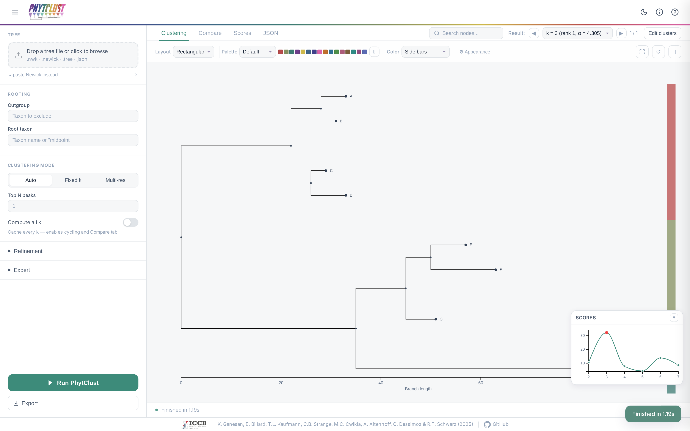

# PhytClust

Clustering for rooted phylogenetic trees.

PhytClust groups the tips of a rooted tree into monophyletic clusters using dynamic programming that minimizes the sum of distances from each node in a cluster to its Most Recent Common Ancestor (MRCA).

PhytClust can be used as a command-line tool, a Python API, as well as a (beta) web browser interface.

## Install

```bash
pip install phytclust
```

From source:

```bash
git clone https://github.com/schwarzlab-ccb/PhytClust.git
cd PhytClust
pip install -e ".[dev]"
```

## Usage

```bash
# cluster a tree into exactly 5 clades
phytclust examples/sample_tree.nwk --k 5 --save-fig

# let PhytClust choose the 3 best values of k
phytclust examples/sample_tree.nwk --top-n 3 --save-fig

# pick one k per resolution scale
phytclust examples/sample_tree.nwk --resolution --bins 4 --save-fig
```

## Web GUI (beta)

There is a browser interface for interactive exploration.



Install the extra dependencies for the GUI:

```bash
pip install "phytclust[gui]"
```

Start it:

```bash
phytclust gui
```

This opens http://127.0.0.1:8000 in your browser. Run `phytclust gui --help` for options
(`--port`, `--reload`), or launch `uvicorn phytclust.gui.api:app` directly.

## Documentation

Tutorials, reference, and background are at
[schwarzlab-ccb.github.io/PhytClust](https://schwarzlab-ccb.github.io/PhytClust/).

To build docs locally:

```bash
pip install -e ".[docs]"
mkdocs serve # http://127.0.0.1:8000
```

## Citation

If you use PhytClust in your research, please cite:

> K. Ganesan, E. Billard, T.L. Kaufmann, C.B. Strange, M.C. Cwikla, A. Altenhoff, C. Dessimoz, R.F. Schwarz.
> *PhytClust* (2025). [github.com/schwarzlab-ccb/PhytClust](https://github.com/schwarzlab-ccb/PhytClust)

## License

GPL-3.0 — see [LICENSE](LICENSE).
