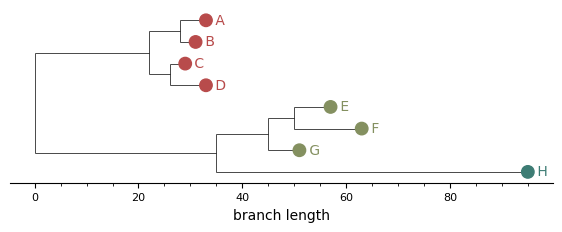
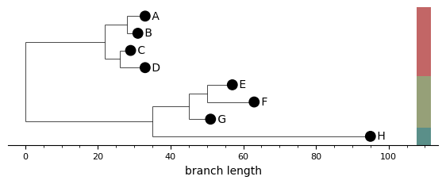
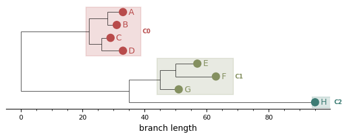
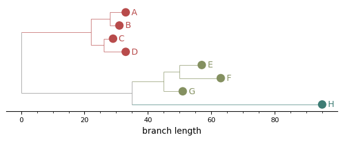
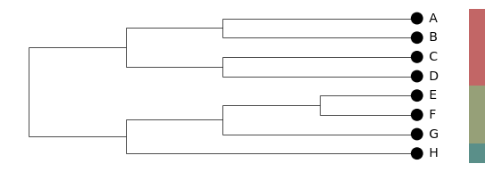
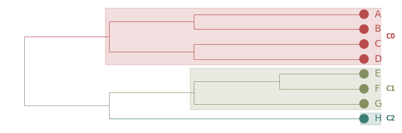
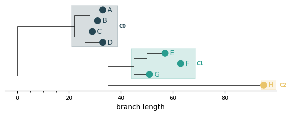

# Visualisation

PhytClust has a few plotting features alongside the algorithm. It is
matplotlib-based, writes PNG, SVG, and PDFs. For interactive
exploration and customized trees, use the [web GUI](getting-started.md#web-gui-experimental).

Every example here was generated from the bundled
[`examples/sample_tree.nwk`](https://github.com/schwarzlab-ccb/PhytClust/blob/master/examples/sample_tree.nwk)
at *k* = 3 via `plot_clusters(pc, k=3, ...)`. All options below are keyword
arguments to `plot_clusters`, or to `plot_cluster` directly.

This page is the reference for the plotting options. `pc.plot()` in the
[Python API reference](reference/index.md#python-api) is the convenience
wrapper; the `phytclust.viz` functions — `plot_clusters`, `plot_cluster` and
`plot_multiple_k` — take the full keyword set, and it is documented here. The
reference lists their signatures and links back to this page.

---

## Defaults

The simplest call colours each leaf marker by cluster.

```python
from phytclust import PhytClust
from phytclust.viz.cluster import plot_clusters

pc = PhytClust("examples/sample_tree.nwk")
pc.run()
plot_clusters(pc, k=3, save=True, results_dir="figures")
```



`k` here need not be one of the *k* values the run selected. `plot_clusters`
backtracks the requested *k* out of the DP table, so any *k* from 1 up to `max_k`
can be plotted once a run has populated it — `pc.run()` above uses global mode
with `top_n=1` and probably did not pick *k* = 3, which is fine. Asking for a *k*
beyond `max_k`, or before any run, raises.

## Side bars

A column of coloured rectangles sits to the right of the leaf labels. Each bar
spans the y-range of one cluster, and consecutive same-cluster leaves merge into
a single rectangle.

```python
plot_clusters(pc, k=3, show_cluster_bars=True, ...)
```



## MRCA boxes

One translucent rectangle per cluster, rooted at the cluster's MRCA and extending
to the right edge of its leaves, with the cluster ID label to the right of the
box. Outlier clusters are drawn as a dashed open box.

This is the static counterpart of the GUI's **Boxes (MRCA)** colour mode.

```python
plot_clusters(pc, k=3, show_cluster_boxes=True, ...)
```



## Branches coloured by cluster

Every edge inside a cluster's subtree, including the vertical spine lines
connecting children, takes the cluster colour. Mixed-cluster edges and the tree
backbone stay grey, so cluster boundaries are readable at a glance.

```python
plot_clusters(pc, k=3, colour_branches_by_cluster=True, ...)
```



## Cladogram layout

`layout="cladogram"` ignores branch lengths and places every leaf at the same
depth, flushing the tree's right edge. This suits trees where topology matters
more than the branch-length scale, or where rate variation makes the phylogram
hard to read. The branch-length axis is hidden automatically in this mode, since
it carries no meaning.

```python
plot_clusters(pc, k=3, layout="cladogram", show_cluster_bars=True, ...)
```



## Combining options

Most options compose. A common manuscript combination is cladogram layout,
branches coloured by cluster, and MRCA boxes:

```python
plot_clusters(
    pc,
    k=3,
    layout="cladogram",
    colour_branches_by_cluster=True,
    show_cluster_boxes=True,
    ...
)
```



## Custom palettes

`palette` takes hex strings or RGB(A) tuples and overrides the default palette.
The list cycles if there are more clusters than colours.

```python
plot_clusters(
    pc,
    k=3,
    show_cluster_boxes=True,
    palette=[
        "#264653", "#2a9d8f", "#e9c46a", "#f4a261",
        "#e76f51", "#8ecae6", "#219ebc", "#023047",
    ],
    ...
)
```



---

## All options

| Argument | Default | Effect |
|---|---|---|
| `k` / `top_n` | `top_n=1` | An explicit cluster count, or the top-N peaks |
| `show_cluster_bars` | `False` | Side bars to the right of the leaves |
| `show_cluster_boxes` | `False` | MRCA-rooted translucent rectangles |
| `colour_branches_by_cluster` | `False` | Tint edges inside each cluster subtree |
| `layout` | `"rectangular"` | `"rectangular"` (phylogram) or `"cladogram"` |
| `palette` | `None` | List of hex / RGB / RGBA colours |
| `cmap` | `"phytclust"` | Matplotlib colormap, used when `palette` is `None` |
| `show_branch_axis` | `True` | Draw the branch-length axis; auto-hidden for cladograms |
| `width_scale` / `height_scale` | `2.0` / `0.1` | Per-leaf horizontal and vertical scaling |
| `marker_size` | `40` | Leaf marker size in points² |
| `hide_internal_nodes` | `True` | Suppress internal node markers and labels |
| `save` | `False` | Write the figure to file; `filename` and `results_dir` set the path |

### Where these defaults come from

`ClusterPlotConfig` is the single source of truth. Any option left unset
resolves from the `RuntimeConfig` on the `PhytClust` object, so the CLI,
`pc.plot()` and `plot_clusters()` all agree:

```python
cfg = RuntimeConfig(plot=PlotConfig(cluster=ClusterPlotConfig(height_scale=0.8)))
pc = PhytClust(tree, runtime_config=cfg)

pc.plot(save=True)                     # height_scale=0.8, from the config
pc.plot(save=True, height_scale=0.5)   # 0.5 — an explicit argument wins
```

Precedence is **explicit argument → `ClusterPlotConfig` → built-in default**.
`ScorePlotConfig` resolves the same way for the score plot.

Outlier clusters carry cluster ID **`-1`**, the same convention used in the
output table and everywhere else in the docs.
